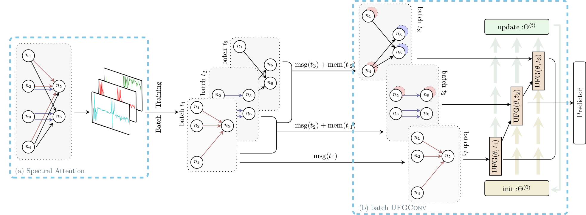

# Well-conditioned Spectral Transforms for Dynamic Graph Representation
<!-- [[arXiv](https://arxiv.org/abs/2111.07602)]  -->


	


## Introduction

This work establishes a fully-spectral framework to capture informative long-range temporal interactions in a dynamic system. We connect the spectral transform to the low-rank self-attention mechanisms and investigate its energy-balancing effect and computational efficiency. Based on the observations, we leverage the adaptive power method SVD and global graph framelet convolution to encode time-dependent features and graph structure for continuous-time dynamic graph representation learning. The former serves as an efficient high-order linear self-attention with determined propagation rules, and the latter establishes scalable and transferable geometric characterization for property prediction. Empirically, the proposed model learns well-conditioned hidden representations on a variety of online learning tasks, and it achieves top performance with a reduced number of learnable parameters and faster propagation speed.


<!-- #### Paper link: [Spectral Transform Forms Scalable Transformer](https://arxiv.org/abs/2111.07602) -->

## Requirements

To install requirements:

```
pip install -r requirements.txt
```
## Dataset and Preprocessing

### Download the public data
Download the sample datasets (eg. wikipedia and reddit) from
[here](http://snap.stanford.edu/jodie/) and store their csv files in a folder named
```data/```.

### Preprocess the data
We use the dense `npy` format to save the features in binary format. If edge features or nodes 
features are absent, they will be replaced by a vector of zeros. 
```{bash}
python utils/preprocess_data.py --data wikipedia --bipartite
python utils/preprocess_data.py --data reddit --bipartite
```


## Running the experiments


### Self-supervised learning using the link prediction task:
```{bash}
# Transductive learning on the wikipedia dataset
python  link_prediction_transductive.py --data wikipedia --drop_out 0.3 --num_modes 70 --memory_dim 150 --n_runs 1 

# Inductive learning on the wikipedia dataset
python link_prediction_inductive.py  --data wikipedia --drop_out 0.3  --memory_dim 150 --gpu 0 --early_stopper 10 --n_runs 1 --num_modes 70 
```

### Supervised learning on dynamic node classification 
(this requires a trained model from the self-supervised task, by eg. running the commands above):
```{bash}
# Node classification
python node_classification.py --drop_out 0.3 --num_modes 70 --memory_dim 150 --n_runs 1 

```


## Citation
If you find this repository helpful, please cite our paper with the bibtex below:

> @inproceedings{zhou2022spedgnn,  
    title={Well-conditioned Spectral Transforms for Dynamic Graph Representation},  
    author={Zhou, Bingxin and Liu, Xinliang and Liu, Yuehua and Huang, Yunying and Lio, Pietro and Wang, YuGuang},  
    booktitle={Learning on Graphs (LOG) Conference},  
    year={2022}  
}

